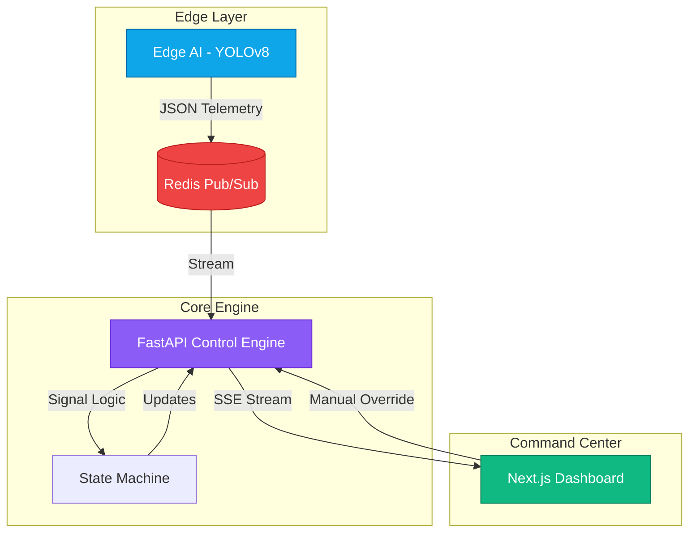

# 🚦 GridSense: AI-Driven Dynamic Traffic Flow Optimizer

**Empowering Urban Infrastructure with Real-Time Computer Vision and Edge Intelligence.**

Developed by **Team GridSense** for the Hackathon.

---

## 🌟 Vision
GridSense is an intelligent traffic management system designed to eliminate unnecessary idling at intersections. By leveraging state-of-the-art computer vision at the edge and a weighted priority control engine, GridSense dynamically adjusts signal timings based on real-world vehicle density and emergency vehicle presence.

## 🏗️ System Architecture
GridSense is built on a decoupled, 4-layer architecture designed for low latency and high reliability.



### 🧠 Core Concepts

#### 1. Edge AI Telemetry (Computer Vision)
The `edge/` layer utilizes **YOLOv8** to process traffic camera feeds in real-time.
- **Object Detection**: Identifies Cars, Trucks, Motorcycles, and Buses.
- **Lane Analytics**: Frame slicing logic maps detections to specific lanes (North, South, East, West).
- **Emergency Detection**: A dedicated ROI (Region of Interest) analysis monitors for the distinct flashing light patterns of ambulances.

#### 2. Weighted Priority Algorithm
Unlike fixed-timer signals, GridSense uses a dynamic scoring formula to decide which lane gets the green light:
$$\text{Score} = (\text{Density} \times 0.6) + (\text{Wait Time} \times 0.4)$$
- **Density (60%)**: Ensures high-traffic lanes are cleared quickly.
- **Wait Time (40%)**: Ensures fair distribution and prevents low-traffic lanes from being ignored.

#### 3. Starvation Guard & Emergency Override
- **Starvation Guard**: If a lane's wait time exceeds 90 seconds, it is automatically assigned a maximum priority score to prevent infinite waiting.
- **Emergency Override**: When an ambulance is detected, the system immediately triggers a "Green Wave" for that lane, overriding all current logic for a configurable duration (default 30s).

---

## 🖥️ Command Center UI
The frontend is a high-performance **Next.js 14** dashboard designed for traffic controllers.

- **Cyberpunk-Industrial Aesthetic**: A high-contrast, dark-mode interface designed for high visibility in control rooms.
- **Real-Time Synchronization**: Uses **Server-Sent Events (SSE)** to provide sub-100ms updates from the backend state machine.
- **Interactive Intersection Map**: A 2D visualization of the physical intersection, showing real-time light states and vehicle densities.
- **Live Event Log**: A forensic trail of every decision made by the AI, including emergency triggers and signal transitions.

---

## 🛠️ Tech Stack

| Layer | Technologies |
| :--- | :--- |
| **Frontend** | Next.js 14, React, Tailwind CSS, Lucide Icons, Mermaid.js |
| **Backend** | FastAPI (Python), Asyncio, Pydantic |
| **Edge AI** | YOLOv8 (Ultralytics), OpenCV, Python |
| **Data/Broker** | Redis (Pub/Sub), Docker |

---

## 🚀 Quick Start (Judge's Guide)

### Prerequisites
- Docker Desktop
- Docker Compose

### Launch the System
```bash
# Clone the repository
git clone https://github.com/AyushCODE1757/grid-sense.git
cd grid-sense

# Start all services
docker compose up --build
```

### Accessing the System
- **Dashboard**: [http://localhost:3000](http://localhost:3000)
- **API Documentation**: [http://localhost:8000/docs](http://localhost:8000/docs)
- **Direct State Stream**: [http://localhost:8000/stream](http://localhost:8000/stream)

---

## 📝 Team GridSense
*Building the future of urban mobility.*
---
*Developed for the India Innovates 2026.*
